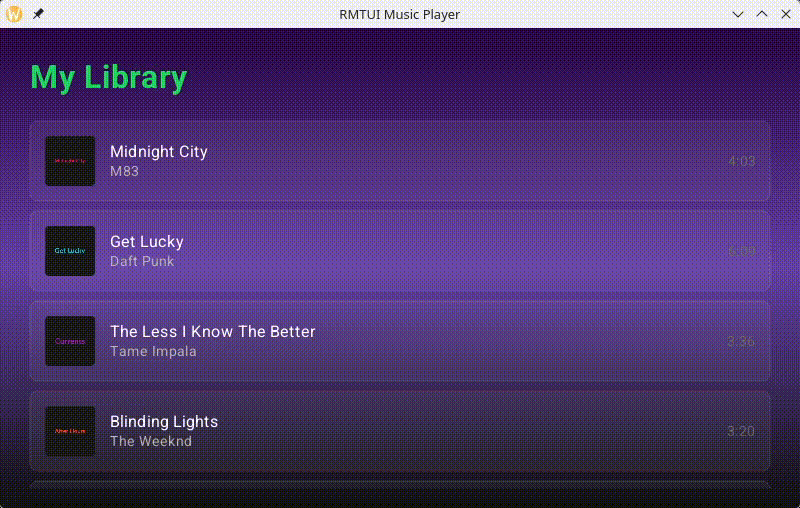
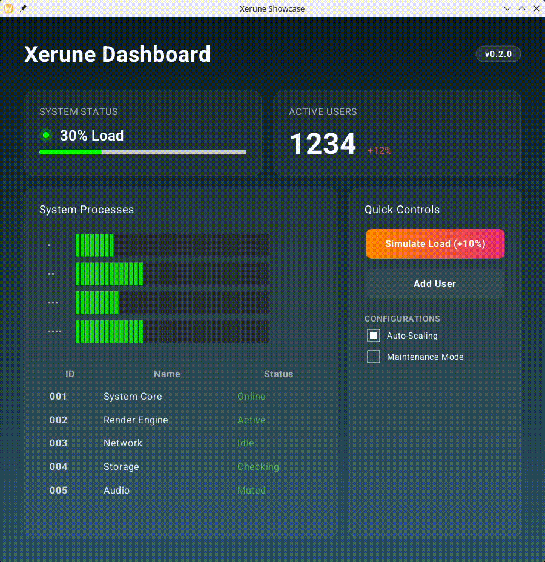

# Xerune

Xerune is a lightweight, CPU-only native HTML renderer designed for embedded Linux environments without GPU support.

## Demos

| Music Player | Showcase | Animation |
| :---: | :---: | :---: |
|  |  |  |

High quality videos: [Music Player](docs/img/music_player.mkv), [Showcase](docs/img/showcase.mkv), [Animation](docs/img/animation.mkv)

## Features

- **Compile time checked templates**: Uses [askama](https://github.com/djc/askama) for safe data bindings.
- **HTML support**: Renders standard HTML elements.
- **No GPU required**: Runs entirely on the CPU with decent performance.
- **Click handling**: Native support for interactive elements.
- **Custom callbacks**: Define logic for interactions.
- **Layout and text rendering**: Built-in support for complex layouts and text.

## Roadmap

- [ ] Dirty region handling
- [ ] Performance improvements
- [ ] ARM Linux as first class citizen
- [ ] Animations
- [ ] Performance and resource optimization (CPU, RAM, storage)
- [ ] More CSS and HTML tags

## Dependencies

Xerune relies on a few key libraries to provide its functionality:

- **[askama](https://crates.io/crates/askama)**: Template rendering engine.
- **[taffy](https://crates.io/crates/taffy)**: Flexbox layout engine.
- **[html5ever](https://crates.io/crates/html5ever)**: HTML parsing.
- **[csscolorparser](https://crates.io/crates/csscolorparser)**: CSS color parsing.
- **[tiny-skia](https://crates.io/crates/tiny-skia)**: Software rendering.
- **[winit](https://crates.io/crates/winit)** & **[softbuffer](https://crates.io/crates/softbuffer)**: Window creation and buffer management (for desktop examples).

## Getting Started

Check out the `examples/` directory to see how to use the library.

### Running Examples

> **Note**: For best performance, please run all examples with the `--release` flag.

```bash
cargo run --release --example music_player
cargo run --release --example todo
cargo run --release --example showcase
```
