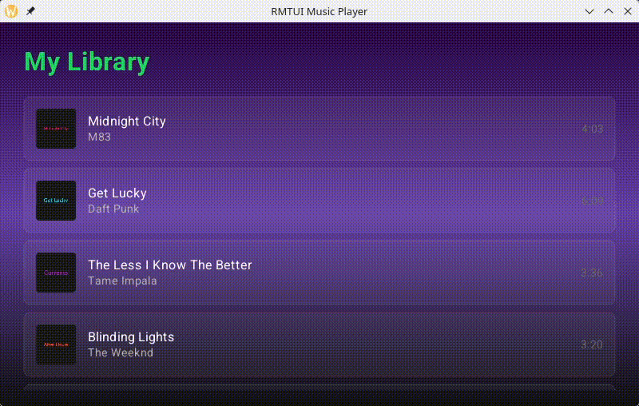
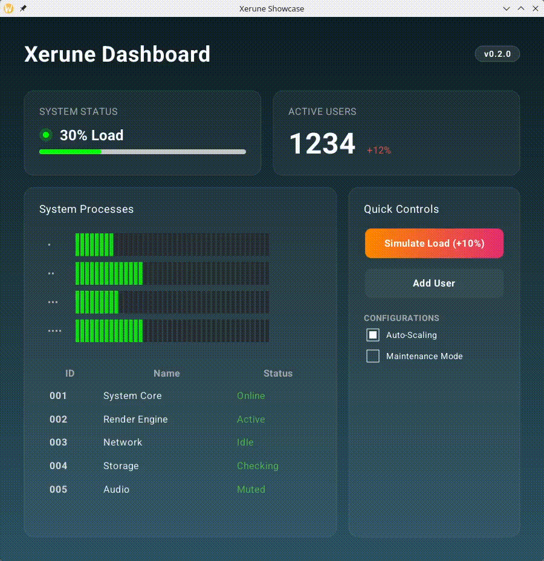

# Xerune

Xerune is a lightweight, CPU-only native HTML/CSS rendering engine and UI framework designed for embedded Linux environments (like Raspberry Pi, QEMU, or custom board systems) without GPU/OpenGLES acceleration.

## Demos

| Music Player | Showcase | Animation |
| :---: | :---: | :---: |
|  |  |  |

High quality videos: [Music Player](docs/img/music_player.mkv), [Showcase](docs/img/showcase.mkv), [Animation](docs/img/animation.mkv)

## Features

- **Model-View-Update (MVU) Architecture**: Elm-style design providing predictable state transitions and unidirectional data flow.
- **Compile-time template verification**: Native type-safe data binding and layout generation.
- **No GPU required**: High-performance CPU-only rendering.
- **Embedded hardware-ready**: Dedicated backends for Linux Framebuffer (`/dev/fb0`) and DRM/KMS with double buffering.
- **Input integration**: Built-in support for mouse, keyboard, and `evdev` touch input bounds calibration.
- **CSS Stylesheets & Keyframe Animations**: Parse inline styles, global styles, classes, IDs, gradients, borders, font weights, and keyframe animations.
- **Responsive Layout**: `@media` queries (width/height/orientation), `vw`/`vh`/`vmin`/`vmax` viewport units, automatic `Model::on_resize` notification, and breakpoint helpers — compiled into cheap static guards for embedded targets.
- **Fingerprint Gating**: Opt-in `Model::view_fingerprint` lets the runtime skip full view rebuilds when a message changes no rendered state.
- **Canvas APIs**: Support for custom user-drawn Canvas pixel buffers.

## Documentation
- [Quick Start Guide](docs/guide.md)
- [Architecture Overview](docs/architecture.md)
- [AI Assistant Context (gemini.md)](gemini.md)

## Architecture

Xerune is built around the **Model-View-Update (MVU)** pattern:
- **Model (`src/model.rs`)**: Owns the application state.
- **View (`Model::view`)**: Takes the model and outputs declarative UI templates.
- **Update (`Model::update`)**: Mutates the model state based on `Message` intents.
- **UI Layout & Style Engine (`src/ui/`)**: Resolves HTML elements and CSS properties onto a Taffy Flexbox tree and generates `DrawCommand`s.
- **Runtime (`src/runtime/`)**: Manages the main execution tick, message queues, and animation intervals.

## Dependencies

- **[taffy](https://crates.io/crates/taffy)**: Flexbox & grid layout engine.
- **[html5ever](https://crates.io/crates/html5ever)**: HTML parsing.
- **[winit](https://crates.io/crates/winit)** & **[softbuffer](https://crates.io/crates/softbuffer)**: Desktop windowing backend.
- **[evdev](https://crates.io/crates/evdev)**: Linux touch & key input handling.
- **[drm](https://crates.io/crates/drm)**: Linux Direct Rendering Manager control.

## Getting Started

### Minimal Example

Xerune applications follow the Elm/MVU architecture using pre-compiled HTML templates and strongly typed messages. For a complete runnable application, see the [Todo List example](examples/todo/).

```rust
use xerune::{Context, Model, XeruneMessage, XeruneTemplate};

// 1. Define application state and link its template
#[derive(Default, XeruneTemplate)]
#[template(path = "todo_list.html")]
pub struct TodoList {
    items: Vec<TodoItem>,
    active_item: usize,
    new_item_title: String,
}

// 2. Define message intents validated at compile time
#[derive(Debug, Clone, XeruneMessage)]
pub enum TodoMsg {
    Toggle(usize),
    Remove(usize),
    Add,
}

// 3. Implement the Model trait
impl Model for TodoList {
    type Message = TodoMsg;

    fn update(&mut self, msg: Self::Message, _ctx: &mut Context) {
        match msg {
            TodoMsg::Toggle(index) => {
                if let Some(item) = self.items.get_mut(index) {
                    item.completed = !item.completed;
                }
            }
            TodoMsg::Remove(index) => {
                if index < self.items.len() {
                    self.items.remove(index);
                }
            }
            TodoMsg::Add => { /* ... */ }
        }
    }
}
```

Templates connect interaction handlers via `data-on-click` (e.g. `data-on-click="toggle:{{ loop.index0 }}"` or `data-on-click="add"`).
See [`examples/todo/templates/todo_list.html`](examples/todo/templates/todo_list.html) for the full layout and CSS.

### Running Examples

> **Note**: For best performance, please run all native examples with the `--release` flag.

```bash
cargo run --release --example todo
cargo run --release --example music_player
cargo run --release --example showcase
cargo run --release --example responsive   # resize the window to see @media / vw adaptation
```

### Running in WebBrowser (WASM & Xerune Studio)

Compile the WebAssembly studio package:

```bash
cd studio
wasm-pack build --target web
cd ..
```

Serve the repository with Python's HTTP server:

```bash
python3 -m http.server 8000
```

Open your browser to:
- **Xerune Studio (Inspector & Controls)**: [http://localhost:8000/studio/index.html](http://localhost:8000/studio/index.html)
- **Standalone Web Runner**: [http://localhost:8000/examples/standalone.html?app=music_player](http://localhost:8000/examples/standalone.html?app=music_player)  
  *(Available apps: `music_player`, `todo`, `calculator`, `breakout`, `animation`, `animation_css`, `showcase`)*

## License

Licensed under the MIT License.
