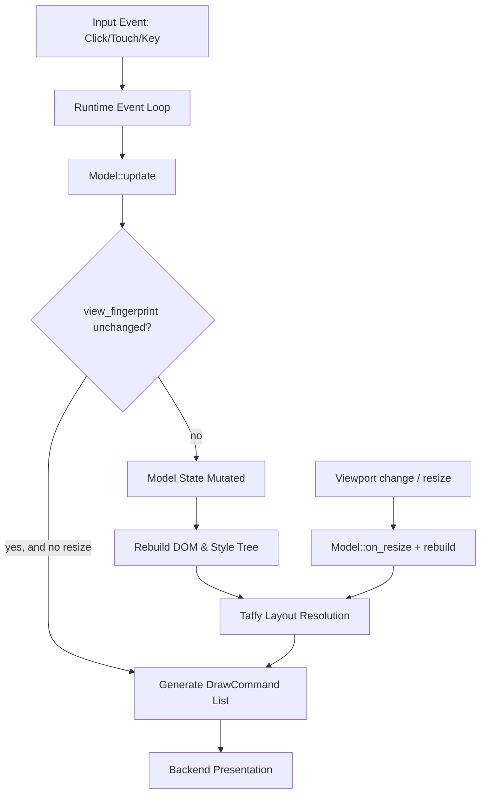

# Xerune Architecture Overview

This document describes the high-level architecture, pipeline flow, and structural design of the Xerune rendering engine.

## Conceptual Framework

Xerune integrates a standard browser-like pipeline (HTML parsing, CSS styling, layout calculation, and graphic drawing) with the Elm/Model-View-Update (MVU) state pattern.

---

## 1. State Management (MVU)

State is strictly isolated inside the `Model` trait:
- **Model**: Custom application state struct.
- **Message**: A user-defined enum containing actions.
- **Context**: Access layer passed to `update` for drawing custom canvases or firing viewport commands.

A tick occurs when:
1. Input events arrive from OS backends.
2. Hit-testing matches display coordinates to an interactive element containing an `onclick` attribute.
3. The event is dispatched to the user's `update` function.

After `update`, the runtime rebuilds the view — unless the model opts into **fingerprint gating** (`Model::view_fingerprint` returns `Some(..)`): if the fingerprint is unchanged since the last rebuild and no viewport change occurred, the costly DOM/style/layout rebuild is skipped. Canvas dirty flags and viewport changes always bypass the skip.

**Responsive state**: The active viewport size lives in `src/screen.rs` as two process-global atomics (`screen::width/height/breakpoint`). On a real resize, `Runtime::set_size` updates these, fires `Model::on_resize`, and rebuilds so `@media`/`vw` re-resolve. Fixed-size embedded displays pay nothing beyond two relaxed atomic reads at startup.

---

## 2. Layout & Stylesheet Pipeline

Xerune parses CSS declarations, matching them to nodes via tags, classes, and IDs:
1. **HTML Parsing**: Performed during template generation.
2. **Media & At-Rule Handling**: The upstream `simplecss` parser drops at-rules, so `src/css/media.rs` provides a minimal `@media` engine. For **compiled templates** (`XeruneTemplate`), the macro splits `@media` blocks at compile time and emits each guarded rule behind a `matches_query(&[FeatureGroup])` predicate built from static `Feature` constants — no runtime parsing. For **runtime string stylesheets** (dynamic-parser path), `expand_for_viewport` inlines matching blocks before `simplecss` parses the result. Supported features: `min/max-width`, `min/max-height`, `orientation`, and `all`/`screen`/`print`/`not`.
3. **Viewport Units**: `vw`/`vh`/`vmin`/`vmax` lengths resolve against `src/screen.rs`'s global viewport at style-application time (`css::parse_px`).
4. **Style Resolution**: CSS property values are resolved onto `ContainerStyle` values (margins, padding, align-items, flex-direction, colors, borders, font configuration).
5. **Taffy Tree**: Layout properties (display, width, heights, paddings, flex configurations) are sent to a `TaffyTree` representing the DOM layout tree.
6. **StyleCacheKey**: To optimize performance on embedded hardware, resolved styles are cached using tag, class, ID, inherited properties, **and the viewport size** (`vw`/`vh` depend on it) to avoid re-resolution.

---

## 3. Render Pipeline

Once the Taffy tree computes the relative position and dimensions of every element, the runtime performs the drawing pass:
1. **Layout Walk**: The engine walks the Taffy tree depth-first, maintaining absolute offsets.
2. **Command Generation**: Nodes are translated into `DrawCommand` variants:
   - `DrawRect`: Renders solid background colors, gradients, borders, and border-radius properties.
   - `DrawText`: Draws text using bitmap fonts.
   - `DrawCheckbox`, `DrawSlider`, `DrawProgress`: Draws native UI primitives.
   - `DrawImage`: Blits raw images.
   - `DrawCanvas`: Blits custom user-drawn Canvas buffers.
3. **Clip Rectangles**: Overflows are restricted by generating `Clip` and `PopClip` commands.
4. **Execution**: The renderer implementation (e.g., fast_renderer) executes the commands onto the screen buffer.

---

## 4. Hardware Backends

Xerune implements system integrations specifically designed for low-power Linux environments:
- **Winit Backend**: Provides cross-platform desktop windows and event polling via `softbuffer`.
- **Linux Framebuffer (`/dev/fb0`)**: Direct memory-mapped CPU blitting, supporting raw 16-bit RGB565 or 32-bit ARGB8888, rotation, and hardware double-buffering page flips.
- **DRM/KMS Backend**: Accesses `/dev/dri/cardX`, setting CRTC mode-setting and Dumb Buffers for true hardware page-flipping without a compositor.
- **evdev Touch Calibration**: Automatically maps raw hardware touch coordinates (min/max bounds) onto display logical pixels.
